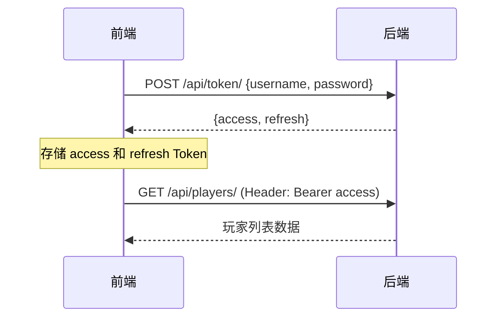

# 🚀 GM-System 前端对接指南

> **版本**: v1.0  
> **更新日期**: 2026-01-01  
> **后端联系人**: 后端负责人  
> **适用对象**: 前端开发者

---

## 📋 目录

1. [基础信息](#1-基础信息-base-info)
2. [核心对接流程](#2-核心对接流程-workflow)
3. [核心接口概览](#3-核心接口概览-api-endpoints)
4. [状态码规范](#4-状态码规范-status-codes)
5. [完整接口清单](#5-完整接口清单)

---

## 1. 基础信息 (Base Info)

### 🌐 Base URL

```
http://127.0.0.1:8000/api/
```

### 🔐 认证方式

采用 **JWT (JSON Web Token)** 认证机制。

| 接口类型 | 是否需要认证 | 说明 |
|----------|-------------|------|
| 登录接口 `/token/` | ❌ 不需要 | 用于获取 Token |
| 刷新接口 `/token/refresh/` | ❌ 不需要 | 用于刷新 Token |
| 公告接口 `/notices/` | ❌ 不需要 | 公开信息 |
| 兑换接口 `/cdks/redeem/` | ❌ 不需要 | 玩家自助兑换 |
| **其他所有接口** | ✅ **需要** | 必须携带 Token |

#### 请求头格式

```http
Authorization: Bearer <Access_Token>
Content-Type: application/json
```

#### 示例

```javascript
// Axios 配置示例
axios.defaults.headers.common['Authorization'] = `Bearer ${accessToken}`;
```

### 📦 响应格式

**所有接口** 统一返回以下 JSON 格式：

```json
{
    "code": 200,
    "message": "success",
    "data": {
        // 实际业务数据
    }
}
```

| 字段 | 类型 | 说明 |
|------|------|------|
| `code` | number | HTTP 状态码 |
| `message` | string | 操作结果描述 |
| `data` | object/array/null | 成功时返回数据，失败时为 `null` |

---

## 2. 核心对接流程 (Workflow)

### 🔑 登录流程



#### Step 1: 登录获取 Token

**请求**

```http
POST /api/token/
Content-Type: application/json

{
    "username": "admin",
    "password": "your_password"
}
```

**响应**

```json
{
    "code": 200,
    "message": "success",
    "data": {
        "access": "eyJ0eXAiOiJKV1QiLC...",
        "refresh": "eyJ0eXAiOiJKV1QiLC..."
    }
}
```

| Token 类型 | 有效期 | 用途 |
|------------|--------|------|
| `access` | **24 小时** | 用于 API 请求认证 |
| `refresh` | **7 天** | 用于刷新 access token |

#### Step 2: Token 刷新

当 `access` 过期（收到 401 错误）时，使用 `refresh` Token 获取新的 `access`：

**请求**

```http
POST /api/token/refresh/
Content-Type: application/json

{
    "refresh": "eyJ0eXAiOiJKV1QiLC..."
}
```

**响应**

```json
{
    "code": 200,
    "message": "success",
    "data": {
        "access": "eyJ0eXAiOiJKV1QiLC...(新的)"
    }
}
```

> ⚠️ **注意**: 如果 `refresh` Token 也过期，需要重新登录。

---

## 3. 核心接口概览 (API Endpoints)

### 3.1 玩家列表

获取所有玩家，支持搜索和分页。

```http
GET /api/players/
Authorization: Bearer <token>
```

**查询参数**

| 参数 | 类型 | 必填 | 说明 |
|------|------|------|------|
| `search` | string | 否 | 按昵称模糊搜索 |
| `ordering` | string | 否 | 排序字段: `level`, `gold`, `diamond`, `created_at` |
| `page` | number | 否 | 页码 |

**示例**

```http
GET /api/players/?search=小明&ordering=-level
```

**响应**

```json
{
    "code": 200,
    "message": "success",
    "data": [
        {
            "id": "550e8400-e29b-41d4-a716-446655440000",
            "nickname": "小明",
            "level": 50,
            "gold": 10000,
            "diamond": 500,
            "status": "normal",
            "created_at": "2026-01-01T10:00:00Z"
        }
    ]
}
```

---

### 3.2 修改金币

给指定玩家增加金币。

```http
POST /api/players/{id}/add_gold/
Authorization: Bearer <token>
Content-Type: application/json
```

**路径参数**

| 参数 | 类型 | 说明 |
|------|------|------|
| `id` | UUID | 玩家 ID |

**请求体**

```json
{
    "amount": 1000
}
```

| 字段 | 类型 | 必填 | 说明 |
|------|------|------|------|
| `amount` | number | ✅ | 增加的金币数量 (必须为正整数) |

**响应**

```json
{
    "code": 200,
    "message": "success",
    "data": {
        "message": "成功为 小明 增加 1000 金币",
        "new_gold": 11000
    }
}
```

---

### 3.3 兑换礼包码

玩家自助兑换 CDK 礼包码。

```http
POST /api/cdks/redeem/
Content-Type: application/json
```

> 📌 **无需认证**，玩家可直接调用

**请求体**

```json
{
    "code": "KURO666",
    "player_id": "550e8400-e29b-41d4-a716-446655440000"
}
```

| 字段 | 类型 | 必填 | 说明 |
|------|------|------|------|
| `code` | string | ✅ | 礼包码 |
| `player_id` | UUID | ✅ | 玩家 ID |

**成功响应**

```json
{
    "code": 200,
    "message": "success",
    "data": {
        "message": "兑换成功！获得 金币 x1000",
        "cdk": {
            "code": "KURO666",
            "item_id": 1,
            "item_count": 1000
        }
    }
}
```

**失败响应示例**

```json
{
    "code": 400,
    "message": "您已经兑换过该兑换码",
    "data": null
}
```

---

### 3.4 领取邮件附件

领取指定邮件的附件奖励。

```http
POST /api/mails/{id}/claim/
Authorization: Bearer <token>
```

**路径参数**

| 参数 | 类型 | 说明 |
|------|------|------|
| `id` | number | 邮件 ID |

**请求体**: 无

**成功响应**

```json
{
    "code": 200,
    "message": "success",
    "data": {
        "message": "领取成功！玩家 [小明] 获得 金币 x500"
    }
}
```

**失败响应示例**

```json
{
    "code": 400,
    "message": "邮件已被领取",
    "data": null
}
```

---

## 4. 状态码规范 (Status Codes)

| 状态码 | 含义 | 前端处理建议 |
|--------|------|-------------|
| `200` | ✅ 请求成功 | 正常处理 `data` |
| `201` | ✅ 创建成功 | 正常处理 `data` |
| `400` | ❌ 请求参数错误 | 提示 `message` 给用户 |
| `401` | 🔒 Token 无效或过期 | 尝试刷新 Token，失败则跳转登录页 |
| `403` | 🚫 没有权限操作 | 提示用户无权限 |
| `404` | 🔍 资源不存在 | 提示资源未找到 |
| `500` | 💥 服务器内部错误 | 提示"系统繁忙"，联系后端排查日志 |

### 401 错误处理流程

```javascript
// Axios 拦截器示例
axios.interceptors.response.use(
    response => response,
    async error => {
        if (error.response?.status === 401) {
            const refreshToken = localStorage.getItem('refresh');
            if (refreshToken) {
                try {
                    const res = await axios.post('/api/token/refresh/', {
                        refresh: refreshToken
                    });
                    localStorage.setItem('access', res.data.data.access);
                    // 重试原请求
                    error.config.headers['Authorization'] = `Bearer ${res.data.data.access}`;
                    return axios(error.config);
                } catch (e) {
                    // Refresh 也失败，跳转登录
                    window.location.href = '/login';
                }
            }
        }
        return Promise.reject(error);
    }
);
```

---

## 5. 完整接口清单

### 🔐 认证接口

| 方法 | 端点 | 说明 | 认证 |
|------|------|------|------|
| POST | `/token/` | 登录获取 Token | ❌ |
| POST | `/token/refresh/` | 刷新 Access Token | ❌ |

### 👤 玩家接口 `/players/`

| 方法 | 端点 | 说明 | 认证 |
|------|------|------|------|
| GET | `/players/` | 获取玩家列表 | ✅ |
| POST | `/players/` | 创建玩家 | ✅ |
| GET | `/players/{id}/` | 获取玩家详情 | ✅ |
| PUT | `/players/{id}/` | 更新玩家信息 | ✅ |
| DELETE | `/players/{id}/` | 删除玩家 | ✅ |
| POST | `/players/{id}/add_gold/` | 增加金币 | ✅ |
| POST | `/players/{id}/ban/` | 封禁玩家 | ✅ |
| POST | `/players/{id}/unban/` | 解封玩家 | ✅ |

### 📧 邮件接口 `/mails/`

| 方法 | 端点 | 说明 | 认证 |
|------|------|------|------|
| GET | `/mails/` | 获取邮件列表 | ✅ |
| GET | `/mails/?player_id=xxx` | 获取指定玩家邮件 | ✅ |
| POST | `/mails/` | 创建邮件 | ✅ |
| GET | `/mails/{id}/` | 获取邮件详情 | ✅ |
| POST | `/mails/{id}/claim/` | 领取邮件附件 | ✅ |

### 📢 公告接口 `/notices/`

| 方法 | 端点 | 说明 | 认证 |
|------|------|------|------|
| GET | `/notices/` | 获取有效公告列表 | ❌ |
| GET | `/notices/{id}/` | 获取公告详情 | ❌ |

### 🎁 礼包码接口 `/cdks/`

| 方法 | 端点 | 说明 | 认证 |
|------|------|------|------|
| GET | `/cdks/` | 获取 CDK 列表 | ✅ |
| GET | `/cdks/{id}/` | 获取 CDK 详情 | ✅ |
| POST | `/cdks/redeem/` | 兑换礼包码 | ❌ |

---

## 📞 联系方式

遇到问题请联系后端开发：

- **接口报错**: 提供请求 URL、请求参数、响应内容
- **500 错误**: 后端会查看服务器日志排查

---

**祝对接顺利！🎉**
